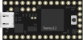
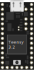

# Fritzing Part - Teensy 3.2
## Description
The Teensy is a complete USB-based microcontoller development system, in a very small footprint, capable of implementing many types of projects. All programming is done via the USB port. No special programmer is needed, only a standard micro-USB cable and a PC or Macintosh with a USB port. It has a USB keyboard/mouse/joystick emulation stack and can be programmed through Arduino IDE.

For more information: http://www.pjrc.com/teensy

## Breadboard

## Icon

## PCB

## Schematic

***

# Installation
1. Copy file `Teensy_3.2.fzpz` to folder `$FRITZING_HOME/bins`
2. Launch `fritzing` app and import `Teensy_3.2.fzpz` into Parts bin named: **My Parts**

### Enjoy!
### @author Gerald.Hurdle@AlgonquinCollege.com